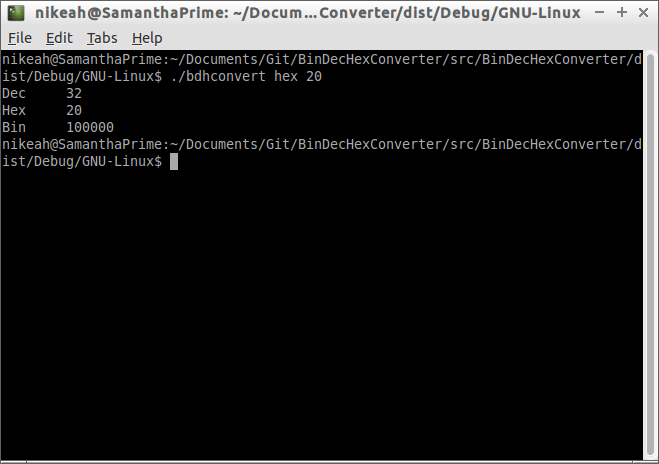

BinDecHexConverter
==================

Small tool to convert between binary, decimal and hexadecimal numbers.


Build Instructions
------------------

```
git clone https://github.com/RedSpiderMkV/BinDecHexConverter
cd BinDecHexConverter
make
```

Can't be more helpful unfortunately, Netbeans takes care of all my build issues, load the project, hit F11 :)


Unit Tests
---------

Using Netbeans, Alt-F6 will run the unit tests.


Usage
-----

Navigate to output directory

Example

```./bdhconvert hex 20```

Shows binary, decimal and hex representation of 0x20



